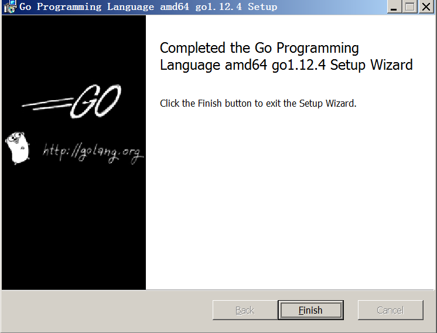
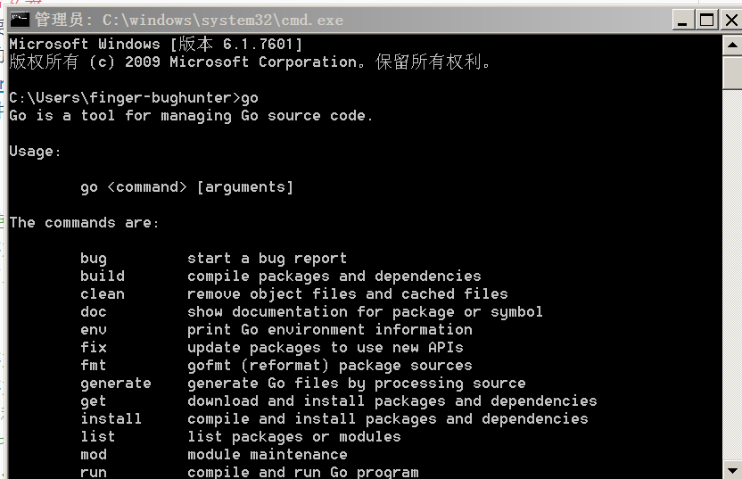
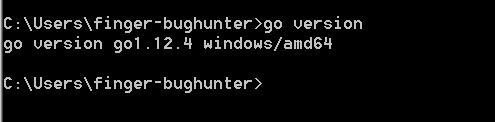

### 配置环境

先讲下我的环境配置，免得到时候因为环境问题gg就尴尬了。

我的平台是windows 7 x64+atom(写markdown)+vscode（写go代码）

#### 1 go语言安装  
这个应该不需要讲解的吧，就下载msi，现在最新版本好像是1.12.4，然后下一步下一步下一步。  
如果想深层次的了解go的话，还可以下载source文件慢慢看~
  
可以查看下文件夹  
`c:\go`
目录释义
```
api — 目录，包含所有API列表，方便IDE使用
bin— 目录，存放编译后的可执行文件
doc— 目录，帮助文档
lib— 目录，
misc— 目录，
pkg— 目录，存放编译后的包文件。pkg中的文件是Go编译生成的
src— 目录，存放项目源文件
注：一般，bin和pkg目录可以不创建，go命令会自动创建（如 go install），只需要创建src目录即可。
Authors— 文件，作者列表，用记事本打开
CONTRIBUTING.md— 文件，
CONTRIBUTORS— 文件，
favicon.ico— 文件，
LICENSE— 文件，license，用记事本打开
PATENTS— 文件，
README.md— 文件，
robots.txt— 文件，使用robots.txt阻止对网址的访问，详情查看https://support.google.com/webmasters/answer/6062608?hl=zh-Hans
VERSION— 文件，版本信息，用记事本打开
```

#### 2 设置环境变量
环境变量需要设置的有两个 一个是`GOROOT`安装目录 一个是`path`bin目录.  
然后在cmd里面验证下.  

#### 3 测试  
  

  看看版本  



#### 4 配置vscode  
有个插件 `https://github.com/microsoft/vscode-go`

先安装好vscode 什么版本都可以,最好是最新版.  
对了有个tips,如果经常使用ss的话,有时候会显示无法连接到拓展商店,这一般是ie的局域网设置问题,就是配置了代理的原因,改回来即可.  

剩下先安装go拓展.
game over

ps:我真是手贱,忘记我这台码字的电脑是没有ss的,我先删了再安装给截图一下,下不了了...就这样吧.
