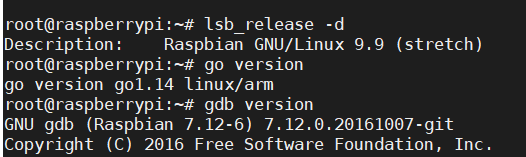
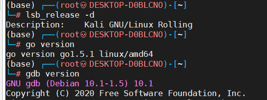

# 环境准备

## 前提说明

### 底层篇
- 系统:kali rolling + raspbian arm
- 硬件:笔记本电脑 + 树莓派 
- 使用VMware或者真机安装均可 + MobaXterm
- golang1.5.1(amd64) golang 1.14(arm64)
- gdb + qira
- IDApro
- dlv

### 安全篇
- IDAGplangHelper
- jeb-golang-analyzer
- 。。。。。。

  

  

## 选用说明

1，kali rolling是平时用的系统，但是更推荐ubuntu系统，比较稳定一点，树莓派是我平时编译arm版本时候使用的，也顺便对比下这个版本。

2，使用14版本是因为这是我当前的编译从常用版本，懒得换了，就这样暂时用着，其实很简单就下载解压做个软连接或者复制过去就行了。

3， 使用1.5.1版本是因为从这个版本进行的自举（bootstrap）[1.5.1源码包下载](go1.5.1.src.tar.gz)  

4，gdb也是因为我kali做ctf常用的reserve-pwn工具而已。。qira是可视化，但是我估计用得少。ida dlv都会介绍有，主要是这三个吧，在底层篇这部分。  

> 附录 1.5.1自举计划。  
> http://www.infoq.com/news/2015/01/golang-15-bootstrapped  

Google最近公布了实现Go 1.5自举（Bootstrap）的计划。相关文档的作者是Go核心开发者Russ Cox，他在Go语言上已经耕耘了接近6年。据Russ介绍，Google就“如何从Go源码树中去除所有的C程序”已经酝酿了一年。

自举（Bootstrapping） 是这样的过程，“用要编译的目标编程语言编写其编译器（或汇编器）”。一般而言，自举有几个优势，比如：

用于测试被自举的语言；
支持使用通常更为高级、提供更多高级抽象的语言来编写编译器；
编译器也可以得益于语言层面的任何改进。
如前所述，Google在一年前就开始了从Go源码树中去除C代码的努力，转换计划分为5个步骤：

第1阶段——开发一个从C语言到Go语言的翻译器，将现有的C编译器翻译成Go语言的。这一阶段利用了一个事实：原来的编译器没有大量使用一些很难移植到Go语言的特性，比如宏、联合和指针运算等。
第2阶段——转换编译器的源码树，得到一个Go语言的编译器，但是比较原始，而且是C风格的。
第3阶段——将前面得到的编译器转换为符合Go语言习惯的程序，主要通过识别包，添加文档和单元测试实现。
第4阶段——优化编译器，解决编译器和CPU的内存使用问题，可能引入并行化。此外，尝试在今天使用的不依赖架构的无序树（Node*s）和依赖架构的有序列表（Prog*s）之间引入一个新的中间表示，目的是改进编译器在消除冗余的nil检查和边界检查等情况下的优化能力。
第5阶段——用最新版的go/parser和go/types替换前端。
Russ提到，他们还考虑了一些替代方案，不过基于各种因素都排除了，在一年前的这份文档中都有描述。

Go的自举

编译器的自举通常会引发“先有鸡还是先有蛋”的问题，必须提供一种方式来编译我们要创建的语言。

Go的情况是，要构建Go 1.5，必须先安装Go 1.4或更高版本，然后使用现有的Go工具链创建Go 1.5工具链的一个基本版本。一旦有了（Go 1.4）编译的Go 1.5工具链，就可以再用它来构建自身了，可以进一步用它构建go_bootstrap和其余的标准库和标准组件。这个过程加入了一个中间步骤——生成的工具链再被用于构建其自身，它可以应用于未来的任何Go版本。

为进一步了解Go实现自举的计划，InfoQ采访了Russ。

实现自举看上去是Go语言的一个很大的里程碑。在语言的演进过程中，为什么决定在这个阶段做这个事情呢，可以详细介绍一下吗？

Go是一门不错的通用语言，但在设计时考虑的适用场合是编写大规模、高并发的服务端软件，就像运行在Google的服务器上的那些。如果更早实现自举，Go编译器就是第一个大型的Go语言程序，这对语言设计存在不利影响，会让我们远离真正的目标。

没有更早实现自举，还有一些技术原因，比如可移植性，从源代码编译比自举更容易，而且我们也能尽早有一个稳定的编译器实现。

使用Go来构建Go，与使用C相比，你认为对哪些具体领域有较为明显的改进？

Ken Thompson曾经对我说，用Go编写程序感觉比用C更简单。一个原因是，Go消除了好几类常见的C bug，比如悬挂指针、内存泄漏、缓冲区溢出、深度递归时的栈溢出、误用void*和意外的数值转换等。

与任何标准的C工具链相比，标准的Go工具链对模块化、单元测试和性能分析支持更好，不过让我最兴奋的是在修改内部API或重构时，应用自动化程序重写（如gofix）的前景。

在“Go 1.3+ Compiler Overhaul”这篇文档中，你描述了分5个步骤将现有的编译器从C迁移到Go的过程。请问到目前为止，已经完成了哪些步骤了？其余步骤打算何时完成？

对Go项目而言，将语言的运行时从C转换到Go更为重要，所以我们先做了这个。现在我们正回到编译器。

从文档角度看，我们目前处于第2阶段。翻译器已经完成，而且帮助我们转换了运行时。我们正在将其应用于编译器。我们希望完成Go 1.5编译器的转换。清理工作会在Go 1.5之后的项目中进行。
