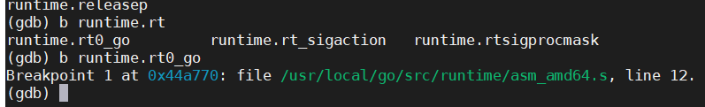
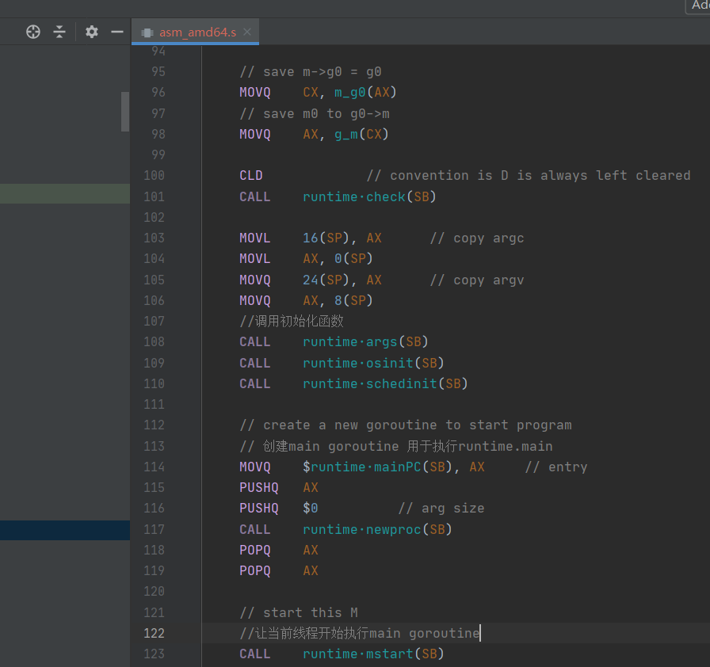
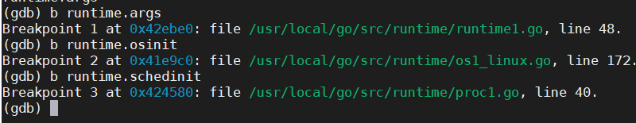
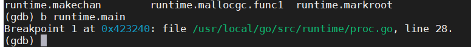

# 引导

事实上，编译好的可执⾏⽂件真正执⾏⼊⼜并⾮我们所写的 main.main 函数，因为编译器总是会插⼊⼀段引导代码，完成诸如命令⾏参数、运⾏时初始化等⼯作，然后才会进⼊⽤户逻辑。  

要从 src/runtime ⽬录下的⼀堆⽂件中找到真正的⼊口，其实很容易。随便准备⼀个编译好的⽬标⽂件，⽐如 “Hello, World!”。

test.go

```go
package main
func main() {
    println("hello, world!")
}
```
编译，然后⽤ `GDB` 查看。
建议：尽可能使⽤命令⾏编译，⽽不是某些 IDE 的菜单命令，这有助于我们熟悉各种编译开关参数的具体功能。其次，调试程序时，建议使⽤ `-gcflags "-N -l"` 参数关闭编译器代码优化和函数内联，避免断点和单步执⾏⽆法准确对应源码⾏，避免⼩函数和局部变量被优化掉。  

`$ go build -gcflags "-N -l" -o test test.go`
如果在平台使⽤交叉编译（Cross Compile），需要设置 GOOS 环境变量。  

```
$ gdb test
(gdb) info files
Local exec file:
Entry point: 0x44dd00
(gdb) b *0x44dd00
Breakpoint 1 at 0x44dd00: file /usr/local/go/src/runtime/rt0_linux_amd64.s, line 8.
```

很简单，找到真正的⼊⼜地址，然后利⽤断点命令就可以轻松找到⽬标源⽂件信息。  

定位到真正的入口文件 rt0_linux_amd64.s

从这个文件开始阅读起，这个文件是汇编，除了汇编文件之外，剩下的均可用go语言来进行阅读了，这个汇编也算是比较简单的，我在底层篇完结的时候上传我的注释代码到这里，到时候可以使用go1.4来编译下go1.5.1了... 是不是很爽啊。  

可以cat看看也行 

打个断 
  

看到代码位于asm_amd64.s  

代码走一走 /usr/local/go/src/runtime/asm_amd64.s

  

对了 忘记说，你也可以直接解压我放在这个目录下的src压缩包 直接用goland去读一读，也能用goland的远程调试配ssh连接代码目录

到这，就算灰白你引导过程结束了，基本上后续都是go代码了...  

# 初始化

一样 设置断点，找到函数所在的源文件名和代码行数，直观的看代码比较好。

  

找到位置后阅读以下

```go
// 函数args整理命令行参数
func args(c int32, v **byte) {
	argc = c
	argv = v
	sysargs(c, v)
}

//函数osint作用是确定CPU数量
func osinit() {
	ncpu = getproccount()
}

// The bootstrap sequence is:
//
//	call osinit
//	call schedinit
//	make & queue new G
//	call runtime·mstart
//
// The new G calls runtime·main.
//几乎所有初始化构造都在这里被调用 上面列举了一些启动过程
func schedinit() {
	// raceinit must be the first call to race detector.
	// In particular, it must be done before mallocinit below calls racemapshadow.
	_g_ := getg()
	if raceenabled {
		_g_.racectx = raceinit()
	}
	//系统线程数量限制
	sched.maxmcount = 10000

	// Cache the framepointer experiment.  This affects stack unwinding.
	//栈 内存分配器 调度器相关初始化
	framepointer_enabled = haveexperiment("framepointer")

	tracebackinit()
	moduledataverify()
	stackinit()
	mallocinit()
	mcommoninit(_g_.m)

	//处理命令行参数和环境变量
	goargs()
	goenvs()
	//处理godebug gotrack 调试相关的环境变量设置
	parsedebugvars()
	//gc 垃圾回收初始化
	gcinit()
	
	sched.lastpoll = uint64(nanotime())
	//通过CPU core 和gomaxprocs环境变量确定p的大小
	procs := int(ncpu)
	if n := atoi(gogetenv("GOMAXPROCS")); n > 0 {
		if n > _MaxGomaxprocs {
			n = _MaxGomaxprocs
		}
		procs = n
	}
	//调整p的大小
	if procresize(int32(procs)) != nil {
		throw("unknown runnable goroutine during bootstrap")
	}
```
初始化操作还没到main.main 还得执行runtime.main

我们再打一个断点

  

我们定位下


```go
func main()
	//执行栈最大限制 64bit是1gb 32bit是250m
	g := getg()

	// Racectx of m0->g0 is used only as the parent of the main goroutine.
	// It must not be used for anything else.
	g.m.g0.racectx = 0

	// Max stack size is 1 GB on 64-bit, 250 MB on 32-bit.
	// Using decimal instead of binary GB and MB because
	// they look nicer in the stack overflow failure message.
	if ptrSize == 8 {
		maxstacksize = 1000000000
	} else {
		maxstacksize = 250000000
	}

	// Record when the world started.
	runtimeInitTime = nanotime()

	//启动系统的后台监控 定时gc 并发任务调度
	systemstack(func() {
		newm(sysmon, nil)
	})

	// Lock the main goroutine onto this, the main OS thread,
	// during initialization.  Most programs won't care, but a few
	// do require certain calls to be made by the main thread.
	// Those can arrange for main.main to run in the main thread
	// by calling runtime.LockOSThread during initialization
	// to preserve the lock.
	lockOSThread()

	if g.m != &m0 {
		throw("runtime.main not on m0")
	}

	//执行runtime所有的init 初始化函数
	runtime_init() // must be before defer

	// Defer unlock so that runtime.Goexit during init does the unlock too.
	needUnlock := true
	defer func() {
		if needUnlock {
			unlockOSThread()
		}
	}()

	//启动gc后台操作
	gcenable()

	main_init_done = make(chan bool)
	if iscgo {
		if _cgo_thread_start == nil {
			throw("_cgo_thread_start missing")
		}
		if _cgo_malloc == nil {
			throw("_cgo_malloc missing")
		}
		if _cgo_free == nil {
			throw("_cgo_free missing")
		}
		if GOOS != "windows" {
			if _cgo_setenv == nil {
				throw("_cgo_setenv missing")
			}
			if _cgo_unsetenv == nil {
				throw("_cgo_unsetenv missing")
			}
		}
		if _cgo_notify_runtime_init_done == nil {
			throw("_cgo_notify_runtime_init_done missing")
		}
		cgocall(_cgo_notify_runtime_init_done, nil)
	}

	//执行用户逻辑入口main.main 就是一开始讲的用户定义
	main_init()
	close(main_init_done)

	needUnlock = false
	unlockOSThread()

	if isarchive || islibrary {
		// A program compiled with -buildmode=c-archive or c-shared
		// has a main, but it is not executed.
		return
	}
	main_main()
	if raceenabled {
		racefini()
	}

	// Make racy client program work: if panicking on
	// another goroutine at the same time as main returns,
	// let the other goroutine finish printing the panic trace.
	// Once it does, it will exit. See issue 3934.
	if panicking != 0 {
		gopark(nil, nil, "panicwait", traceEvGoStop, 1)
	}

	到这里执行结束 返回结束状态码
	exit(0)

```

```go
//runtime_init和main_init是编译器动态生成的
//go:linkname runtime_init runtime.init符号名变化
func runtime_init()

//go:linkname main_init main.init
func main_init()
```

到这里如果想观察下最终动态生成代码的汇编代码的话，可能会更好理解。但是gdb看长一点的汇编需要翻页了，我没接鼠标的，有点麻烦。就暂时不写了，可以写个复杂一点的例子看看，也可以用qira可视化操作，或者ida都可以，go也有一个go tool objdump都行。  

### 总结

- 所有的init函数都在一个goroutine内
- 所有的init函数结束exit后才执行用户逻辑入口的main.main