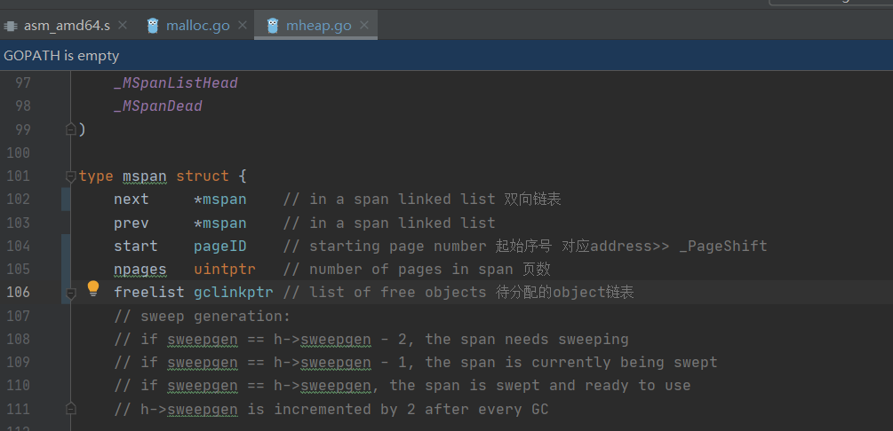

# 内存操作
# malloc

## 内存分配算法

- 初始化
- 分配
- 回收
- 释放
- 固定分配器
- 关联函数recordspan

也在src/runtime/下
malloc.go

mheap.go

  

用于存储对象的object 按8字节的倍数分为多种。  

分配器会尝试将多个微小对象组合到一个object块内，目的是节约内存。

分配器初始化，会对照表存储大小和规格的对应关系进行构建，用以切分的span页数

msize.go
```go
// Size classes.  Computed and initialized by InitSizes.
//
// SizeToClass(0 <= n <= MaxSmallSize) returns the size class,
//	1 <= sizeclass < NumSizeClasses, for n.
//	Size class 0 is reserved to mean "not small".
//
// class_to_size[i] = largest size in class i
// class_to_allocnpages[i] = number of pages to allocate when
//	making new objects in class i
```

