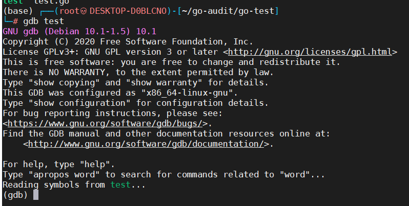
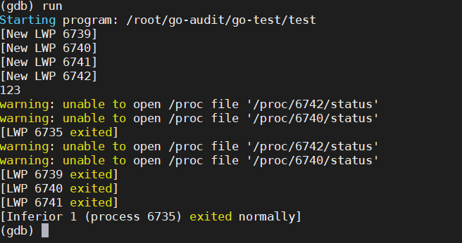
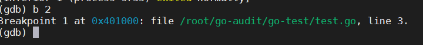
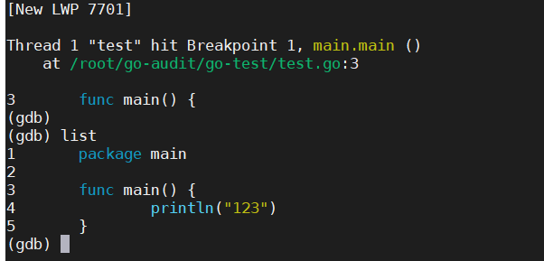

# gdb基础使用指南

例子还是之前test.go 就是一个helloworld。

gdb test

  

出现了Reading symbols from test...

就算是载入成功了。   
启动之后首先看看这个程序是不是可以运行起来,只要输入run命令回车后程序就开始运行,程序正常的话可以看到程序输出如下,和我们在命令行直接执行程序输出是一样的：

  

  

上面例子b 2表示在第2行设置了断点,之后输入run开始运行程序,现在程序在前面设置断点的地方停住了,我们需要查看断点相应上下文的源码,输入list就可以看到源码显示从当前停止行的前几行开始：


  

现在GDB在运行当前的程序的环境中已经保留了一些有用的调试信息,我们只需打印出相应的变量,查看相应变量的类型及值：

```
(gdb) info locals
isexit = 0
count = 1
c = 0xc210039060
(gdb) p count
$1 = 1
(gdb) p c
$2 = (chan int) 0xc210039060
(gdb) whatis c
type = chan int
```

每次输入c之后都会执行一次代码,又跳到下一次for循环,继续打印出来相应的信息,设想目前需要改变上下文相关变量的信息,跳过一些过程,得出修改后想要的结果：

 
```
(gdb) info locals
isexit = 0
count = 2
c = 0xf840001a50
(gdb) set variable isexit=1
(gdb) info locals
isexit = 1
count = 3
c = 0xf840001a50
(gdb) c
Continuing.
c: 3
main end
[LWP 11588 exited]
[Inferior 1 (process 11588) exited normally]
``` 

最后稍微思考一下，前面整个程序运行的过程中到底创建了多少个goroutine，每个goroutine都在做什么：

 
```
(gdb) run
The program being debugged has been started already.
Start it from the beginning? (y or n) y
Starting program: /root/go-audit/go-test/test 
warning: no loadable sections found in added symbol-file system-supplied DSO at 0x2aaaaaaab000
main start

Breakpoint 2, main.main () at /root/go-audit/go-test/test.go:25
25                      fmt.Println("c:", count)
(gdb) info goroutines 
* 1  running runtime.park
* 2  syscall runtime.notetsleepg
  3  waiting runtime.park
  4 runnable runtime.park
(gdb) goroutine 3 bt
#0  0x0000000000415586 in runtime.park (unlockf=void, lock=void, reason=void) at /usr/local/go/src/pkg/runtime/proc.c:1342
#1  0x0000000000420084 in runtime.tsleep (ns=void, reason=void) at /usr/local/go/src/pkg/runtime/time.goc:79
#2  0x000000000041ffb1 in time.Sleep (ns=void) at /usr/local/go/src/pkg/runtime/time.goc:31
#3  0x0000000000400c38 in main.counting (c=0xc210039060) at /root/go-audit/go-test/test.go:10
#4  0x0000000000415750 in ?? () at /usr/local/go/src/pkg/runtime/proc.c:1385
#5  0x000000c210039060 in ?? ()
#6  0x0000000000000000 in ?? ()
``` 

 

通过查看goroutines的命令我们可以清楚地了解goruntine内部是怎么执行的，每个函数的调用顺序已经明明白白地显示出来了.

本文简单介绍了GDB调试Go程序的一些基本命令,通过上面的例子演示,如果你想获取更多的调试技巧请参考官方网站的GDB调试手册,还有GDB官方网站的手册

## GDB使用

help + 命令就可以查看这个命令的详细帮助信息  
### 查看信息
### info

我用过的  
info share ： info sharedlibrary 查看加载了什么库，地址好像不准，maps文件的才准（其实直接输入sharedlibrary命令就行了，不过没有地址而已，不过那个地址也不准的样子）  
i b :查看断点  
i r ：查看寄存器， i r eax edx：只查看eax和edx

#### 官方文档： 

```
info address -- Describe where symbol SYM is stored
info all-registers -- List of all registers and their contents
info args -- Argument variables of current stack frame
info auxv -- Display the inferior's auxiliary vector
info breakpoints -- Status of user-settable breakpoints
info catch -- Exceptions that can be caught in the current stack frame
info checkpoints -- IDs of currently known checkpoints
info classes -- All Objective-C classes
info common -- Print out the values contained in a Fortran COMMON block
info copying -- Conditions for redistributing copies of GDB
info dcache -- Print information on the dcache performance
info display -- Expressions to display when program stops
info extensions -- All filename extensions associated with a source language
info files -- Names of targets and files being debugged
info float -- Print the status of the floating point unit
info frame -- All about selected stack frame
info functions -- All function names
info handle -- What debugger does when program gets various signals
info inferiors -- IDs of currently known inferiors
info line -- Core addresses of the code for a source line
info locals -- Local variables of current stack frame
info macro -- Show the definition of MACRO
info mem -- Memory region attributes
info os -- Show OS data ARG
info proc -- Show /proc process information about any running process
info program -- Execution status of the program
info record -- Info record options
info registers -- List of integer registers and their contents
info scope -- List the variables local to a scope
info selectors -- All Objective-C selectors
info set -- Show all GDB settings
info sharedlibrary -- Status of loaded shared object libraries
info signals -- What debugger does when program gets various signals
info source -- Information about the current source file
info sources -- Source files in the program
info stack -- Backtrace of the stack
info symbol -- Describe what symbol is at location ADDR
info target -- Names of targets and files being debugged
info tasks -- Provide information about all known Ada tasks
info terminal -- Print inferior's saved terminal status
info threads -- IDs of currently known threads
info tracepoints -- Status of tracepoints
info types -- All type names
info variables -- All global and static variable names
info vector -- Print the status of the vector unit
info warranty -- Various kinds of warranty you do not have
info watchpoints -- Synonym for ``info breakpoints''
info win -- List of all displayed windows
```

### x

x /50x 0xxxxxx   
x /5i 0xxxxxx  

```
Examine memory: x/FMT ADDRESS.
ADDRESS is an expression for the memory address to examine.
FMT is a repeat count followed by a format letter and a size letter.
Format letters are o(octal), x(hex), d(decimal), u(unsigned decimal),
  t(binary), f(float), a(address), i(instruction), c(char) and s(string).
Size letters are b(byte), h(halfword), w(word), g(giant, 8 bytes).
The specified number of objects of the specified size are printed
according to the format.
```
### print

打印寄存器的值：print $eax  
打印符号，如下  

```
print main
$2 = {int (int, char , char )} 0x8049ab9 <main>
```

### 查看栈

backtrace – Print backtrace of all stack frames（查看函数调用栈）[bt full显示的信息更加详细，其实就多显示了当前函数的局部变量]  
frame默认跟上面显示的没什么差别  
up显示上层函数的调用，不过好像只能看一层  
where 好像显示所有调用栈  

### 调试

调试core文件(ulimit -c unlimited开启不限制core文件大小，因为默认是0)  
core文件没设置的话应该默认在当前目录  
gdb 程序名 core文件路径 或者 gdb 程序名 –core core文件路径  
### 调试命令

```
r 运行
c 继续运行，直到碰到断点或异常才会停止
ni 单步
si 步入
jump 跳到那里执行
start – Run the debugged program until the beginning of the main procedure
set follow-fork-mode child 跟随fork出来的子进程
更多请查看文档
help running
```
### 断点
#### 普通断点

```
b *0x88888888
b main
b *0x666666 if $rdi==0x666
```
#### 删除断点
d 序号（那个是 i b的序号）
#### “硬件断点”
watch 0x66666666
还有 rwatch，awatch

### 设置成intel格式的汇编

set disassembly-flavor intel

### 其他

add-symbol-file 加载符号文件  
shell ：可临时切换到shell，exit就可以回到gdb了  

### 新发现的东西
checkpoints可以新启动一个进程，运行到当前位置  
info checkpoints 可以查看  
restart 序号就可以切换了  
### 最近发现的超好用的——202009
### 条件记录断点

类似windbg的条件记录断点效果  
下了断点后，使用command命令，加上断点的序号即可，之后就可以输入命令了，最后以end结尾就行  

`command <breakpoint_Num>`

```
gdb-peda$ bl
Num     Type           Disp Enb Address            What
2       breakpoint     keep y   0x0000000000402a00 
3       breakpoint     keep y   0x0000000000402a0a 
gdb-peda$ commands 3
Type commands for breakpoint(s) 3, one per line.
End with a line saying just "end".
>echo rdx=
>print $rdx
>x /20gx 0x620000
>end
gdb-peda$
```
### 给原有断点加上条件

这个是不用加if了

`condition <breakpoint_Num> 条件`
例子

`condition 2 $rdx==1`
### 执行多个指令，跳过多次断点


```
# 执行num个指令
ni <num>
# 跳过num个断点
c <num>
```
### pwndbg插件
那些很少被人用的功能
vis_heap_chunks，可视化查看chunks
```
vis_heap_chunks <个数(可选)> <起始地址(可选)>
```


## 安装peda 和pwndbg 插件

有手就行