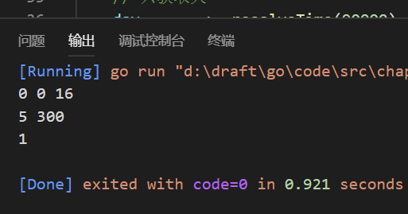

### 示例1
#### 将"秒"解析为时间单位

说明：  
在本例中，使用一个数值表示时间中的秒值，然后使用resolveTime()函数将传入的秒数转为天 小时 分钟等相应的时间单位。

```golang
package main

import "fmt"

const {
  SecondsPerMinute = 60

  SecondsPerHour = SecondsPerMinute * 60

  SecondsPerDay = SecondsPerHour * 24
}

func resolveTime(seconds int) (day int, hour int, minute int) {

  day = seconds / SecondsPerDay
  hour = seconds / SecondsPerHour
  minute = seconds / SecondsPerMinute

  return
}

func main() {

  fmt.Println(resolveTime(1000))

  _, hour, minute := resolveTime(18000)
  fmt.Println(hour, minute)

  day, _, _ := resolveTime(90000)
  fmt.Println(day)
}
```

代码输出：
```
0 0 16
5 300
1
```

代码文件[eg1.go](code/eg1.go)  

截图:  
  
