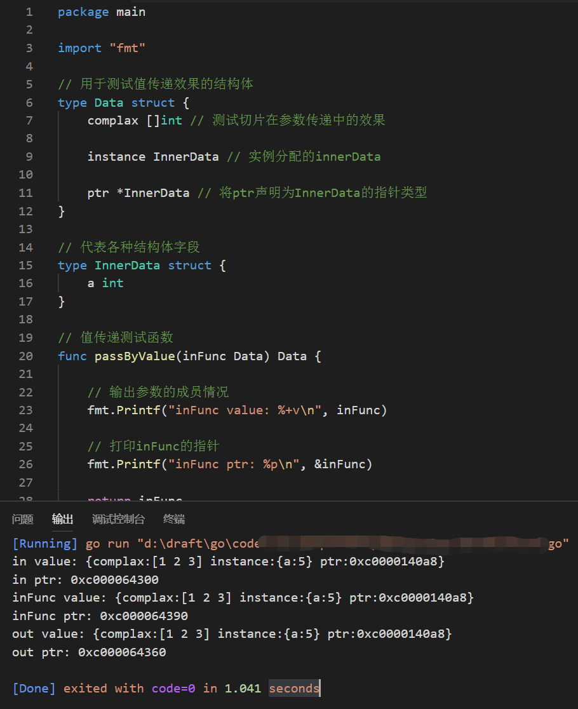

### 示例2
#### 函数汇总的参数传递效果测试

说明:  
go语言中传入和返回参数在调用和返回时都是用值传递,  
这里主要注意的事指针,切片和map等引用型对象只想的内容在参数传递中不会发生复制,  
而是将指针进行复制,类似于创建一次引用.

#### 1 测试数据类型

为了测试结构体 切片 指针以及结构体中嵌套的结构体在值传递中会发生的情况,需定义一些结构.
```go
package main

import "fmt"

// 用于测试值传递效果的结构体
type Data struct {
	complax []int // 测试切片在参数传递中的效果

	instance InnerData // 实例分配的innerData

	ptr *InnerData // 将ptr声明为InnerData的指针类型
}

// 代表各种结构体字段
type InnerData struct {
	a int
}
```
#### 2 值传递的测试函数

定义的passByValue函数用于值传递的测试,该函数的参数和返回值都是data类型.在调用中,data的内存会被复制后传入函数,在函数返回时,又会见返回值复制赋值给函数返回值的接受变量. 如:
```go
// 值传递测试函数
func passByValue(inFunc Data) Data {

	// 输出参数的成员情况
	fmt.Printf("inFunc value: %+v\n", inFunc)

	// 打印inFunc的指针
	fmt.Printf("inFunc ptr: %p\n", &inFunc)

	return inFunc
}
```

#### 3 测试流程

测试流程会准备一个data格式的数据结构并填充所有成员,这些成员类型包括切片 结构体成员及指针.通过调用测试函数,传入data结构数据,并获得返回值,对比输入和输出后的data结构数值变化
```go
func main() {

	// 准备传入函数的结构
	in := Data{
		complax: []int{1, 2, 3},
		instance: InnerData{
			5,
		},

		ptr: &InnerData{1},
	}

	// 输入结构的成员情况
	fmt.Printf("in value: %+v\n", in)

	// 输入结构的指针地址
	fmt.Printf("in ptr: %p\n", &in)

	// 传入结构体，返回同类型的结构体
	out := passByValue(in)

	// 输出结构的成员情况
	fmt.Printf("out value: %+v\n", out)

	// 输出结构的指针地址
	fmt.Printf("out ptr: %p\n", &out)
}

```
代码输出:
```
in value: {complax:[1 2 3] instance:{a:5} ptr:0xc0000140a8}
in ptr: 0xc000064300
inFunc value: {complax:[1 2 3] instance:{a:5} ptr:0xc0000140a8}
inFunc ptr: 0xc000064390
out value: {complax:[1 2 3] instance:{a:5} ptr:0xc0000140a8}
out ptr: 0xc000064360
```

截图:  
  

代码文件[eg1.go](code/eg1.go)  

运行结果分析:  
一data结构指针地址发生了变化,意味着所有接口都是一块新的内容,也就是说发生了复制行为.  
二成员值没有变化,原样传递意味着所有参数都是值传递.  
三data结构的ptr成员在传递过程中保持一致,表示指针在函数参数值传递中农传递的知识指针值,不会赋值指针指向的部分.  
